# Salesforce → Tigerpaw CSV Converter


[](https://github.com/btoth525/Salesforce-to-Tigerpaw-Converter/actions/workflows/docker-publish.yml)

A production-ready Flask + React web app that turns Salesforce CSV exports into Tigerpaw-ready imports. Drop a file (or ten), preview the transform, optionally edit cells inline, and download. Ships as a single Docker image for Unraid / Docker / Compose.

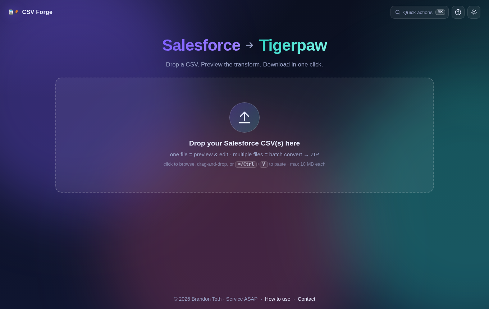

- 📖 [Step-by-step Scribe guide](https://scribehow.com/viewer/How_to_Use_Brandons_Salesforce_To_TigerPaw_Converter__UcSaDyXrQbyyoozC531-CQ)
- 📝 [CHANGELOG](CHANGELOG.md)

---

## Highlights

- **Preview before you commit** — side-by-side original ↔ converted tables with row search and hover-tooltips explaining every column change.
- **Drag one file or drop ten** — single files go to the preview stage; 2+ files auto-route to a batch view that streams back a ZIP.
- **Edit inline** — click any converted cell to edit before download. Optional; the no-edit path stays one click.
- **Command palette (⌘K)** — searchable menu of every action, contextual to the current stage.
- **Global drop-anywhere** — drag a file over the window and the entire app becomes a drop target.
- **Toasts, skeleton loader, count-up stats** — the small polish that makes it feel like a $50/month product.
- **Dark / light themes** with persistence, plus a keyboard help overlay (`?`).
- **Admin panel at `/admin`** — see who's using it, live event feed, device breakdown, per-user drill-down. Password-gated.
- **Safe by default** — 10 MB upload cap, encoding sniffed without loading the whole file, fail-fast `SECRET_KEY` + `ADMIN_PASSWORD` in production, directory-traversal protection, non-root container, `/api/health` HEALTHCHECK.

---

## Tour

### Preview the transform

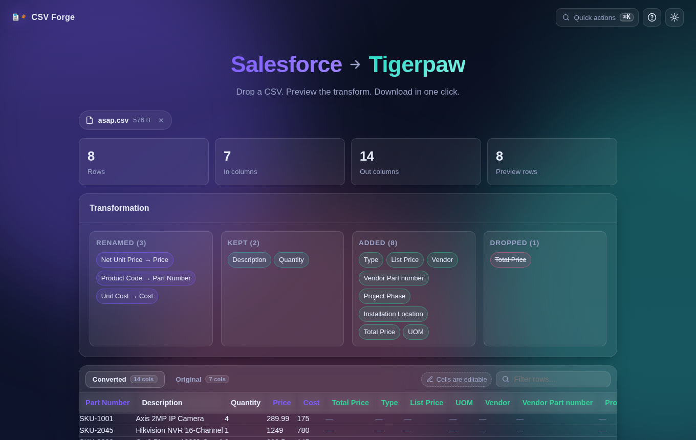

A stat bar (with animated count-ups), the four-bucket **Transformation** card (Renamed / Kept / Added / Dropped), and the tabbed original↔converted table. Column headers in the converted tab reveal contextual tooltips on hover (*"Renamed from: Product Code"*, *"Added empty · Tigerpaw column"*, *"Kept from source"*, *"Preserved extra column"*). Renamed columns are purple; added columns are green with a `+` suffix.

### Inline editing

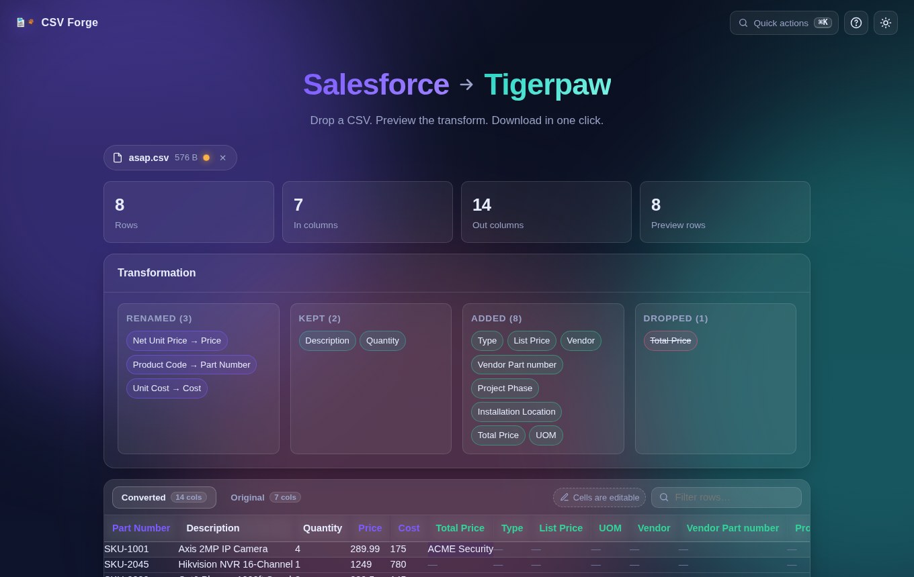

Click any converted cell → it becomes an input. Enter commits, Esc cancels. Edit anything and the file chip sprouts an amber pulsing dot, a "Revert edits" button appears, and the primary action splits into **Download as-is** / **Download edited** so you can choose. Don't edit anything and the UX is identical to v1.0.

### Command palette

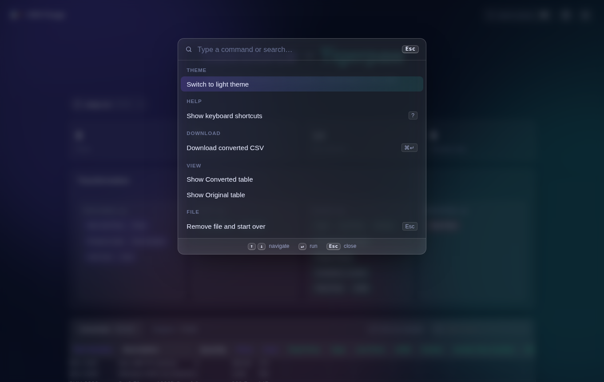

`⌘K` / `Ctrl+K` anywhere. Every action is reachable without a mouse: download, revert edits, toggle theme, switch tabs, clear the filter, browse for files, remove the current file. The list is contextual — edits, revert, and tab-switching only appear in the preview stage.

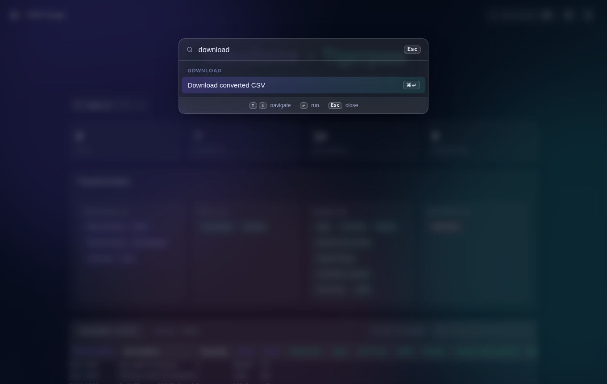

Type to filter by title, keyword, or group.

### Batch convert

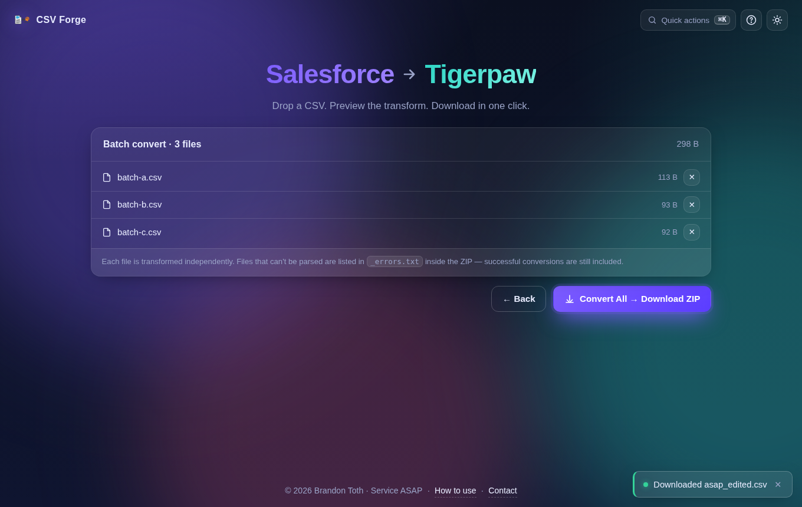

Drop 2-25 CSVs → batch stage. Single pulsing **Convert All → Download ZIP** button. Files that fail validation are listed inside `_errors.txt` in the zip, so partial success still yields useful output. Individual `✕` per file re-routes back to single-file preview if you cull down to one.

### Drop-anywhere

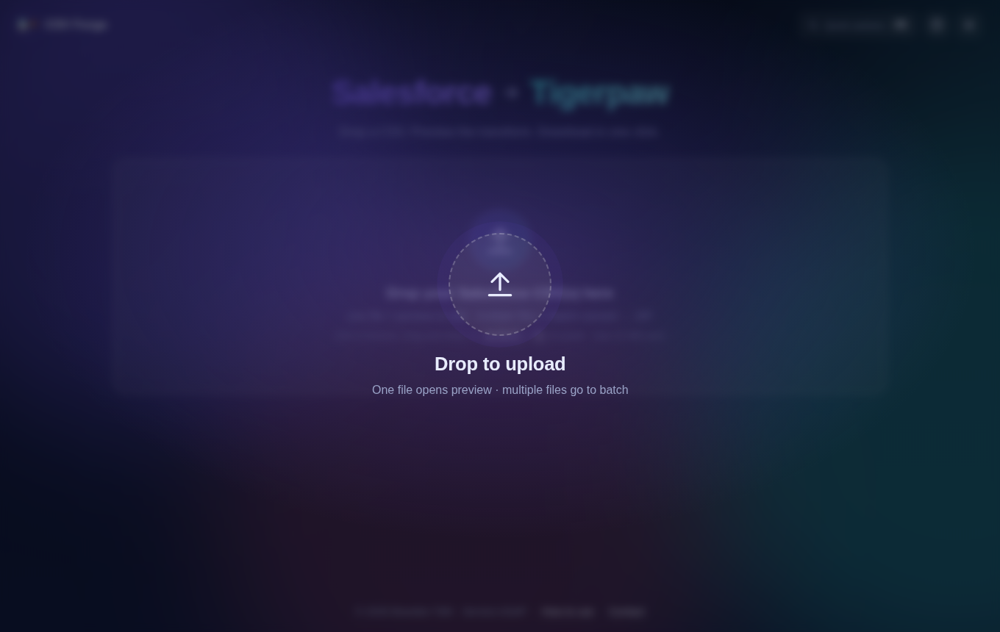

Drag a file over any part of the page and the whole window becomes a drop target with a pulsing ring. No need to aim at the small dropzone.

### Success toasts

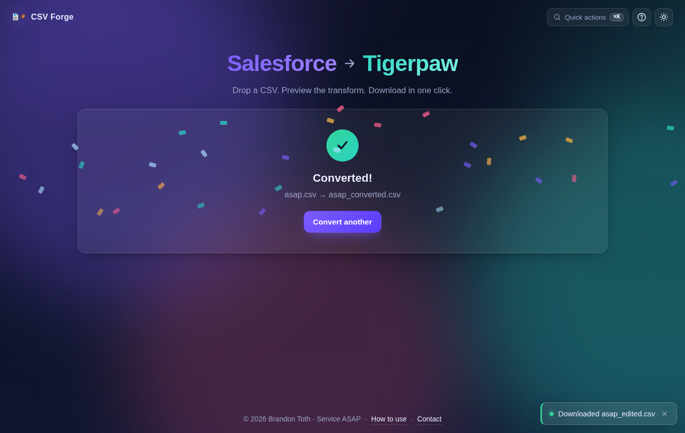

Every action (download, revert, batch complete) surfaces a corner toast with the actual filename. Errors show red; warnings (e.g. "File has 2,300 rows — editing disabled") show amber. Auto-dismisses after ~4s or click the `✕`.

### Light mode

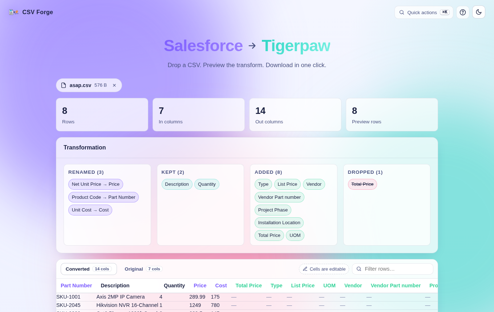

Every element has light-theme styling. Theme preference is persisted to `localStorage`.

### Help overlay

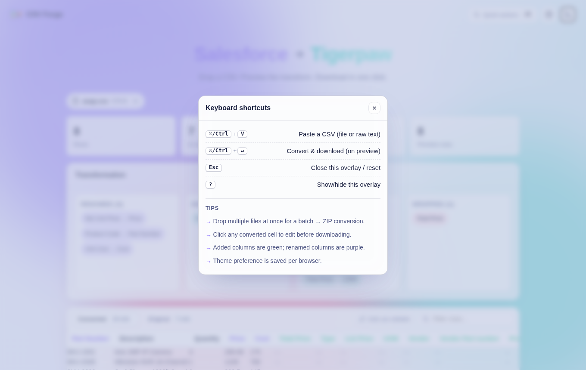

Press `?` anywhere for the shortcut cheatsheet.

### Name prompt + user chip

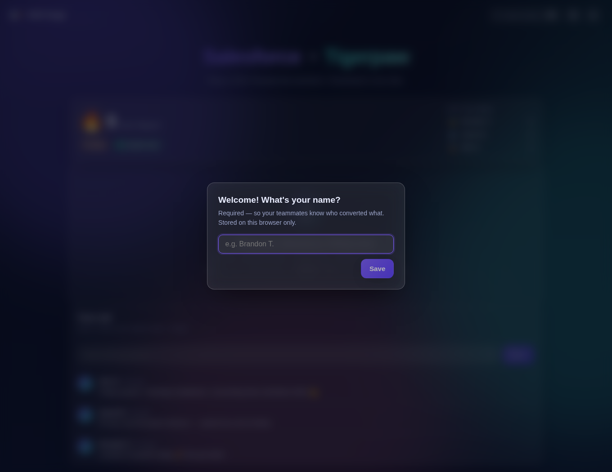

First-visit modal asks for a name — **required, no skip**. The name is stored in
`localStorage` and sent as `X-User-Name` on every API request so the admin
panel can attribute activity. Shows as a chip in the top bar; click to change.

### Team wall + live stats on the main page

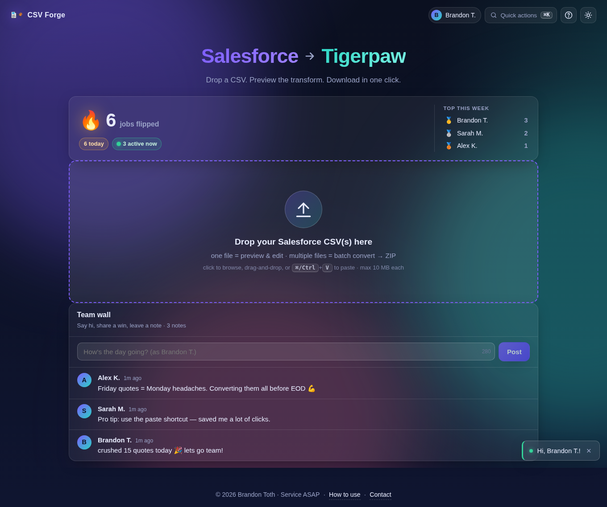

The idle page leads with a live **🔥 jobs flipped** counter (animated count-up),
today's count, a green pulsing "active now" pill, and the top-5 leaderboard for
the current week.

Below the drop zone, the **Team Wall** is a 280-char shoutbox where anyone who's
identified can post a quick note — celebrate a win, share a tip, drop a vibe.
Auto-refreshes every 30s.

---

## Admin panel

`/admin` is password-gated via the `ADMIN_PASSWORD` env var. Telemetry
persists in a SQLite file at `/app/data/forge.db` (mount a volume in
production).

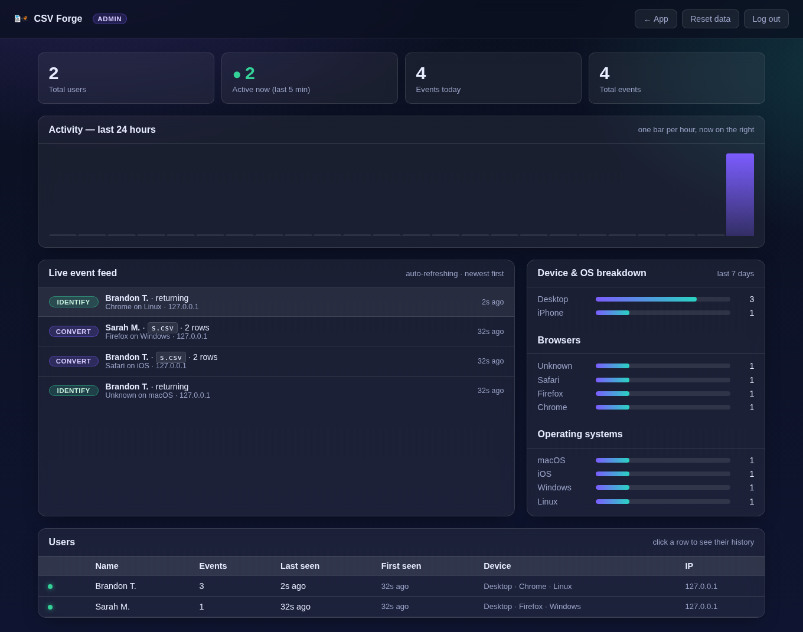

- **Stat cards** — total users, active now (pulsing dot if anyone's used
  the app in the last 5 minutes), events today, total events.
- **Activity chart** — one bar per hour for the last 24 hours, "now" on
  the right.
- **Live event feed** — auto-refreshes every 5 seconds, color-coded pills
  per event type (`identify`, `preview`, `convert`, `convert_edited`,
  `convert_batch`), filename + row count + device + IP + relative time.
- **Device / OS / browser breakdowns** — the last 7 days, with percent bars.
- **User table** — active-now green dot, event count, last seen, first
  seen, device fingerprint, last IP. Click any row for the drill-down.

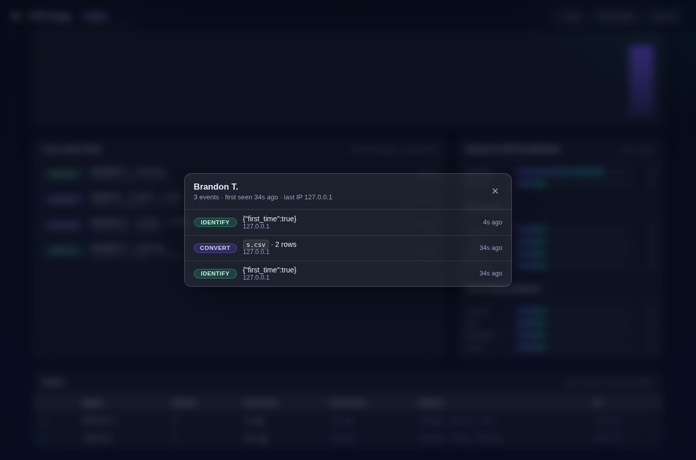

Click a user to see their last 50 events in detail.

**Actions:**
- **Reset data** (top right) — wipes every user + event. Confirm prompt first.
- **Log out** — clears the admin session cookie.

### Admin login

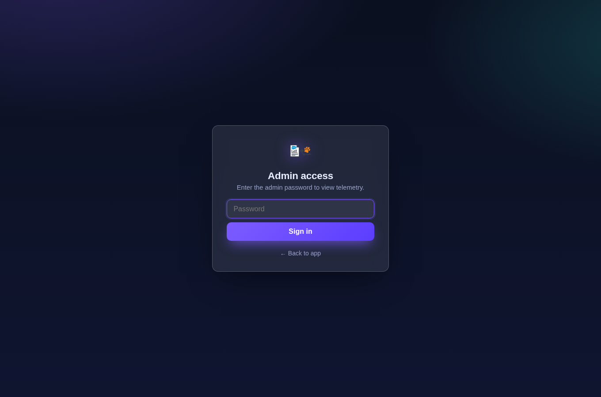

### Admin API

All admin JSON endpoints require the session cookie set by `/admin/login`.

| Method | Path | Purpose |
| --- | --- | --- |
| `GET`  | `/admin` | Dashboard HTML |
| `GET/POST` | `/admin/login` | Password form + submit |
| `POST` | `/admin/logout` | Clear session |
| `GET`  | `/admin/api/stats` | Summary + hourly activity + device/OS/browser breakdowns |
| `GET`  | `/admin/api/users` | All users, newest `last_seen` first |
| `GET`  | `/admin/api/user/<id>` | Single user + last 50 events |
| `POST` | `/admin/api/user/<id>/delete` | Delete one user and all their events + notes |
| `GET`  | `/admin/api/events?limit=N` | Recent events (newest first, max 500) |
| `GET`  | `/admin/api/export` | Download every event as a CSV (for Excel / audit) |
| `POST` | `/admin/api/reset` | Wipe all telemetry |

### Privacy

- Data is stored locally in SQLite; nothing leaves the container.
- No geolocation by default (IP is logged but not resolved to a location).
  IPs behind `X-Forwarded-For` (Unraid's reverse proxy, etc.) are captured
  as the first hop — set `FLASK_TRUSTED_HOSTS` if you need stricter.
- `localStorage` holds the user's name only on their browser.
- `docker exec -it salesforce-to-tigerpaw sqlite3 /app/data/forge.db` gets
  you a direct prompt if you need to query or delete specific rows.

---

## Keyboard shortcuts

| Keys | Action |
| --- | --- |
| `⌘/Ctrl + K` | Open command palette |
| `⌘/Ctrl + V` | Paste a CSV (file or raw text) |
| `⌘/Ctrl + ↵` | Convert & download (preview or batch) |
| `Esc` | Close overlay / reset / go back |
| `?` | Show keyboard shortcuts |

---

## Deploy

Prebuilt image on GHCR:
```
ghcr.io/btoth525/salesforce-to-tigerpaw-converter:latest
```

### Unraid — Add Container (Advanced View)

| Field | Value |
| --- | --- |
| **Name** | `salesforce-to-tigerpaw` |
| **Repository** | `ghcr.io/btoth525/salesforce-to-tigerpaw-converter:latest` |
| **Network Type** | `Bridge` |
| **WebUI** | `http://[IP]:[PORT:5023]/` |
| **Port** — WebUI | Container `5023` → Host `5023` (TCP) |
| **Path** — data | Host `/mnt/user/appdata/salesforce-to-tigerpaw/` → Container `/app/data` |
| **Variable** — `SECRET_KEY` | *any long random string*, e.g. `openssl rand -hex 32` |
| **Variable** — `ADMIN_PASSWORD` | password for the `/admin` dashboard |
| **Variable** — `FLASK_ENV` | `production` |

### Docker CLI

```bash
docker run -d \
  --name salesforce-to-tigerpaw \
  -p 5023:5023 \
  -e SECRET_KEY="$(openssl rand -hex 32)" \
  -e ADMIN_PASSWORD="your-admin-password" \
  -e FLASK_ENV=production \
  -v /mnt/user/appdata/salesforce-to-tigerpaw:/app/data \
  --restart unless-stopped \
  ghcr.io/btoth525/salesforce-to-tigerpaw-converter:latest
```

### Docker Compose

```bash
# .env
SECRET_KEY=<paste long random string>

docker compose up -d
```

Container health is reported via `/api/health`.

> If `docker pull` returns `denied`, the GHCR package is set to Private.
> Open Package settings → Change visibility → Public, or `docker login
> ghcr.io` with a PAT scoped `read:packages`.

---

## Development

**Prerequisites:** Python 3.12+, Node 20+.

```bash
# backend — http://localhost:5023
python -m venv .venv && source .venv/bin/activate
pip install -r requirements.txt
python SalesforceToTigerpaw.py

# frontend (separate shell) — http://localhost:5173
cd frontend
npm install
npm run dev
```

The Vite dev server proxies `/api/*` to Flask, so you hit the React UI at
`http://localhost:5173` and it talks to the live backend transparently.

### Tests + lint

```bash
python -m unittest                  # 20 tests, ~0.3s
cd frontend && npm run lint         # eslint
cd frontend && npm run build        # production bundle
```

---

## API

| Method | Path | Purpose |
| --- | --- | --- |
| `POST` | `/api/convert` | Single CSV → converted Tigerpaw CSV. |
| `POST` | `/api/convert-batch` | N CSVs under `files` → ZIP (`_errors.txt` inside for any failures). |
| `POST` | `/api/convert-edited` | JSON `{ filename, columns, rows }` → CSV (for post-preview edits). |
| `POST` | `/api/preview` | Single CSV → JSON preview (first 500 rows + mapping metadata + `truncated` flag). |
| `POST` | `/api/identify` | Register / update the current user's name. Rejects empty / "Guest". |
| `GET`  | `/api/public-stats` | Public totals + top-5 weekly leaderboard (safe to display on the idle page). |
| `GET`/`POST` | `/api/notes` | Team wall — read recent notes, post a new one (280 char max). |
| `GET`  | `/api/health` | `{"status":"ok"}` — used by the container HEALTHCHECK. |
| `GET`  | `/` and `/<path>` | Serves the React SPA. |

All endpoints accept `multipart/form-data` or JSON and return `400` JSON with an `error` key on bad input. Max upload: 10 MB; max files per batch: 25.

---

## Column transformation

### Source → Destination

| Salesforce column | Tigerpaw column |
| --- | --- |
| `Product Code` | `Part Number` |
| `Description` | `Description` |
| `Quantity` | `Quantity` |
| `Net Unit Price` | `Price` |
| `Unit Cost` | `Cost` |

- `Total Price` — values dropped, column re-added empty so Tigerpaw can recompute.
- **Added (empty):** `Type`, `List Price`, `Vendor`, `Vendor Part number`, `Project Phase`, `Installation Location`, `UOM`.
- Any other source columns are preserved and appended at the end.
- Output is UTF-8 with BOM and CRLF line endings (Excel/Tigerpaw friendly).

Required columns are enforced; if any of the five source columns are missing, the converter returns `400` with the list of missing column names.

---

## Configuration

| Env var | Required | Default | Notes |
| --- | --- | --- | --- |
| `SECRET_KEY` | yes in prod | random per-process in dev | Startup **fails** if `FLASK_ENV=production` and this is unset. |
| `ADMIN_PASSWORD` | yes in prod | `admin` in dev | Password for `/admin`. Startup fails in production if unset. |
| `FLASK_ENV` | no | unset | Set to `production` for the prod check. |
| `PORT` | no | `5023` | Gunicorn bind port inside the container. |
| `FORGE_DATA_DIR` | no | `/app/data` (container) or `./data` (dev) | Where `forge.db` (SQLite telemetry) lives. Mount a volume here in production. |
| `ENABLE_GEOIP` | no | `0` | Set to `1` to resolve IP → city/region/country via ip-api.com (free tier) and show it in the admin event feed. Results cached 30 days in SQLite; IPs from private ranges are skipped. Third-party dependency — read the privacy note before enabling. |

---

## Repository layout

```
Salesforce-to-Tigerpaw-Converter/
├── SalesforceToTigerpaw.py       # Flask app + CSV transform pipeline
├── requirements.txt              # Python deps
├── tests/test_app.py             # unittest suite (transform + routes)
├── Dockerfile                    # multi-stage: Node build → Python runtime
├── docker-compose.yml            # GHCR-based one-command deploy
├── docs/screenshots/             # README imagery
├── .github/workflows/
│   └── docker-publish.yml        # buildx → ghcr.io on push / tag
└── frontend/                     # Vite + React SPA
    ├── src/App.jsx               # main UI
    ├── src/App.css               # theme + aurora + tables + overlays
    └── vite.config.js            # dev proxy /api → Flask
```

---

## Release

`main` + semver tags drive the published image tags:

- Every push to `main` → `:latest` + `:sha-<short>`
- Tag `v1.2.3` → `:1.2.3`, `:1.2`, `:latest`
- Branch pushes (including `claude/**`) → `:<branch-name>` (for testing)

Cut a release:
```bash
git tag v1.2.0 && git push --tags
```

---

## Troubleshooting

- **Tigerpaw import complains about columns** — Confirm the Salesforce export contains `Product Code`, `Description`, `Quantity`, `Net Unit Price`, `Unit Cost`. The preview panel's Transformation card lists exactly what got mapped.
- **`413 File too large`** — Upload is over 10 MB. Split the export or raise `MAX_UPLOAD_BYTES` in `SalesforceToTigerpaw.py`.
- **Container reports unhealthy** — `docker logs salesforce-to-tigerpaw`; the HEALTHCHECK hits `/api/health` on the internal port.
- **GHCR pull fails with `denied`** — Package is still Private. Open Package settings → Change visibility → Public (or login with a PAT).
- **"Editing disabled" toast** — File has more rows than the preview cap (500). Use Download as-is, or split the file.

---

## Contributing

Pull requests welcome. For non-trivial changes, open an issue first.
Please keep `python -m unittest` green and run `npm run lint` in
`frontend/` before submitting.

---

## License

MIT — see [LICENSE](LICENSE).

## Contact

Brandon Toth — ASAP Security Services — <Btoth@serviceasap.com>
